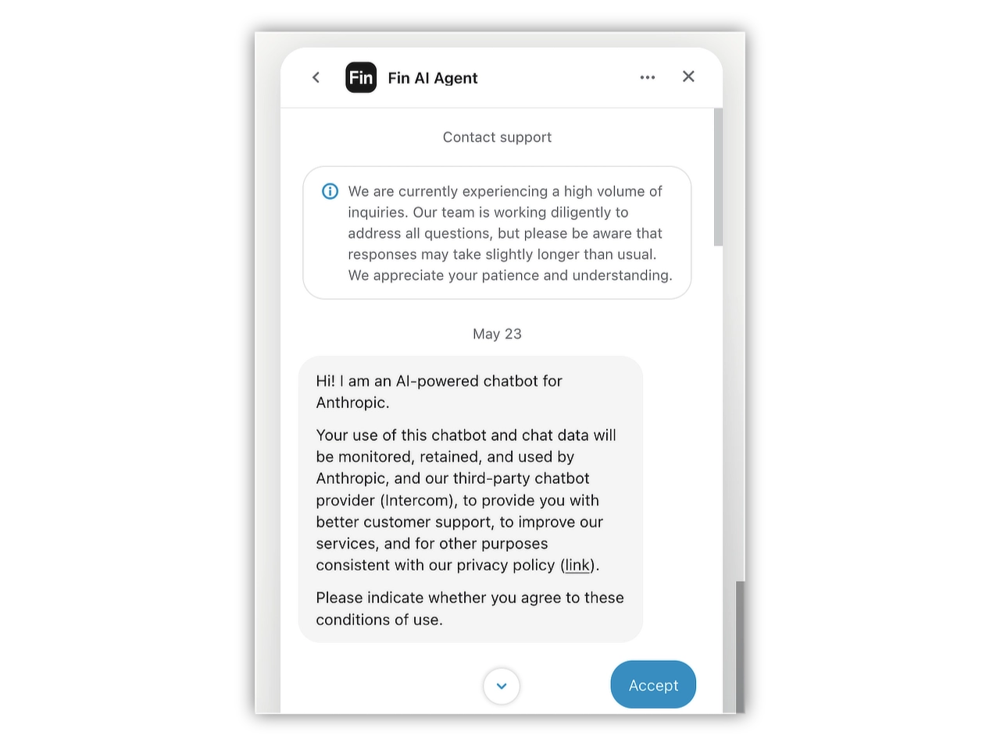
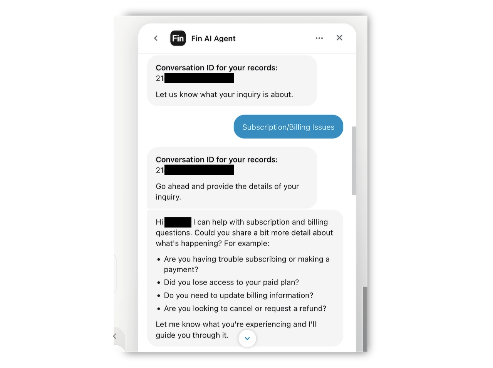
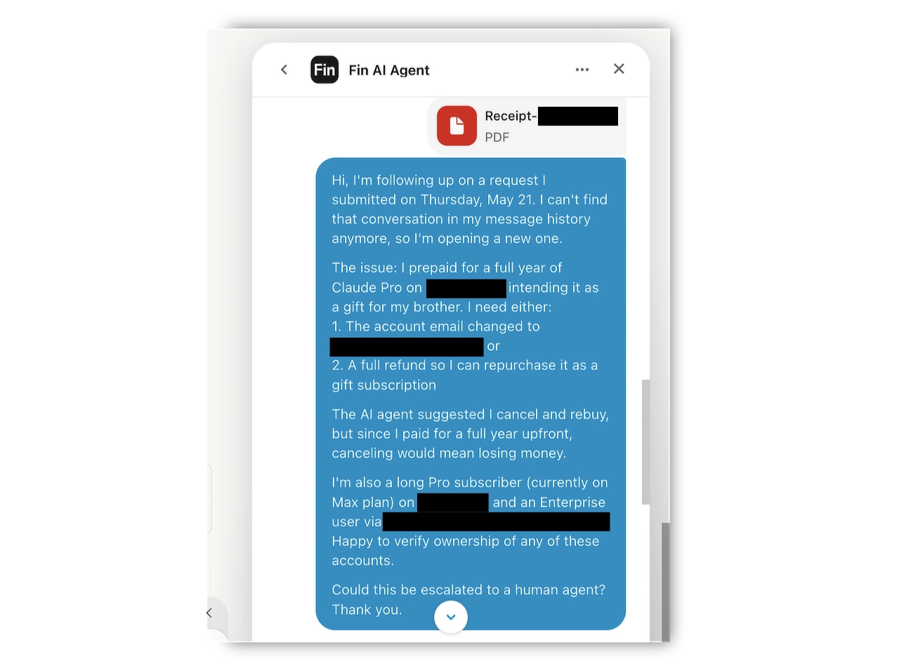
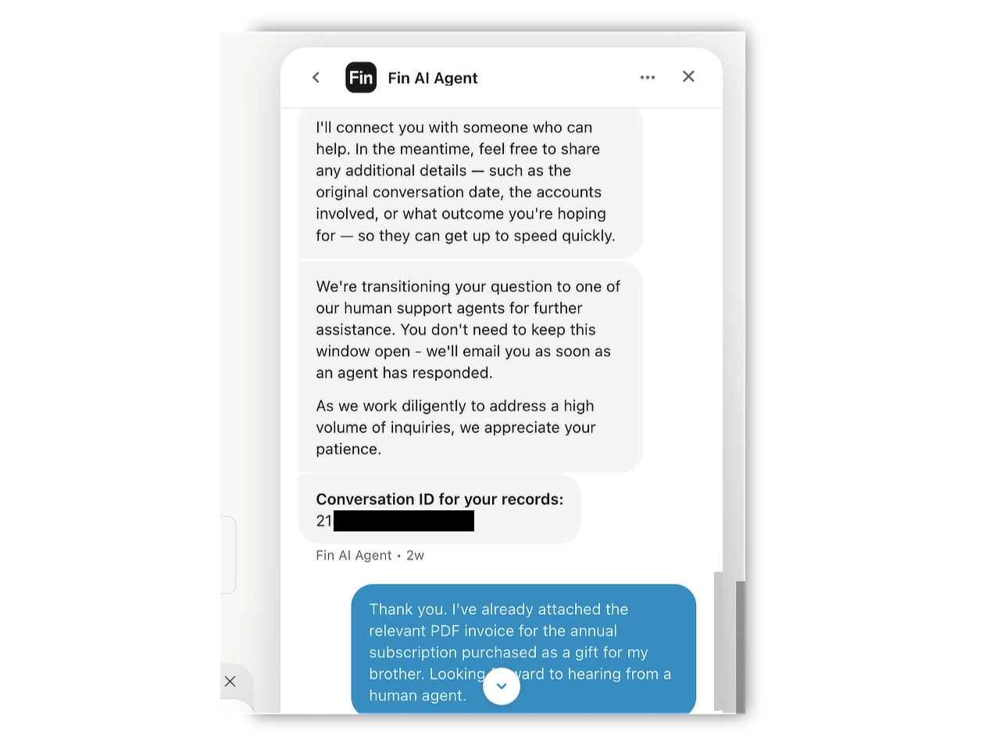
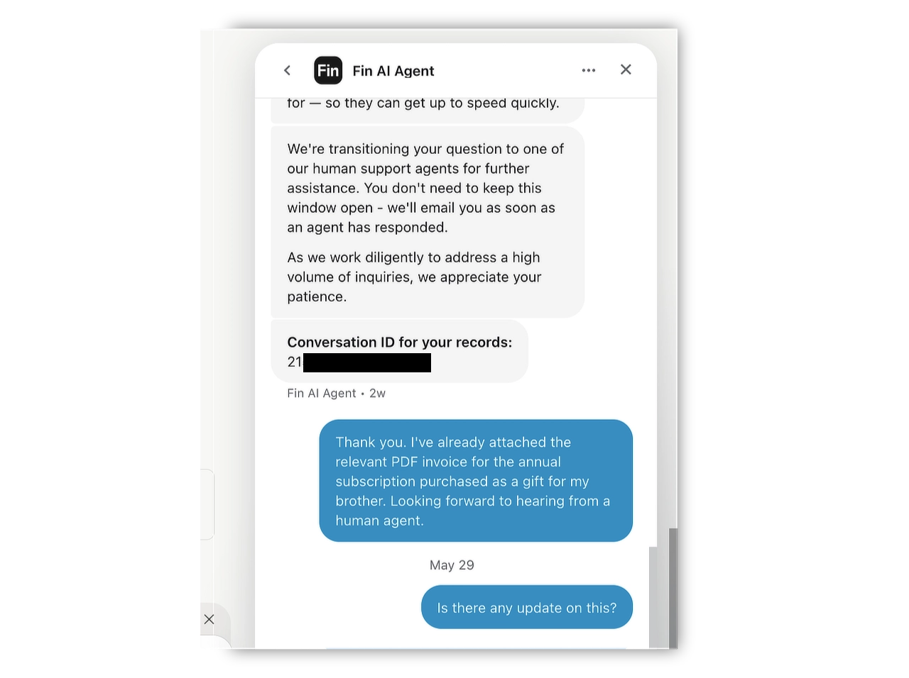

# Anthropic support does not exist

Anthropic's customer support is some of the most impressive corporate vaporware I have ever encountered. But before I get into the details, let me share two memories.

## Game Masters in blue robes

When I was a kid, back in the era of BBSes and phones attached to walls with cables, I bought an adventure game on 3.5" floppy disks. The box contained a poster, three floppies, and a user manual. I absolutely loved that game, but somewhere around the halfway point I got hopelessly stuck and couldn't figure out how to progress.

Then I noticed something on the box: the address and phone number of the company that made the game. So what does a kid do? I just called them. Someone picked up, I explained I was stuck, and that person walked me through exactly what to do - over the phone. I suspect it wasn't even a support line. I'm pretty sure one of the developers just answered the phone.

Those were the days.

Later, at university, I played a ridiculous amount of World of Warcraft, back when it was at the peak of its popularity. This was still the era when Blizzard was a great company with a stellar reputation. If you had a problem with the game - say, you accidentally destroyed an important item - you could open a support ticket directly inside the game. And the support was *great*. Usually a Game Master would message you and you'd just chat in-game. They had this fun, slightly role-play tone and were always genuinely helpful. But the best part: sometimes the Game Master would *physically* show up - their character, dressed in blue robes, materializing next to you to sort out your problem.

That was about 20 years ago.

## Press 1 to be ignored

Today we've all been conditioned to accept absolutely abysmal corporate support - support that probably only exists because some law forces companies to "provide assistance". Try getting anything done with Microsoft or Google. Years ago I could call Microsoft and the support person even spoke my language. Today the workflow is: you post on a forum or open a GitHub issue, and you either get ignored completely, or you receive a useless AI-generated response that is, at best, a copy-paste from ChatGPT.

Unless, of course, you're like the company I work for and you pay heavy money for premium support. Then the help is genuinely good - a Microsoft guy, usually an absolute wizard, pings you on Teams and asks if you have a minute for a quick screen share. So the knowledge and the people are there. They're just behind a paywall.

## Then there's Anthropic

I've been a Claude Pro subscriber for a long time, I'm currently on Max, and my company has an Enterprise plan on top of that. By any reasonable definition, I'm the customer they should care about.

My brother was (note the past tense) an AI skeptic, so I decided to get him a birthday present: a full year of Claude Pro, paid upfront. What I didn't anticipate is that Anthropic doesn't let you change the email address on an account. At all.

My plan was simple: register the account under one of my email aliases, prepay the whole year, then change the email to my brother's address so he'd receive a ready-to-use account as a gift. On his birthday, I discovered that this option simply doesn't exist.

So on **May 21** - three weeks ago - I opened a ticket asking for either a manual email change or a refund (in which case I'd just create a fresh account with the correct email and repurchase). The AI bot displayed some conversation ID... and then the whole conversation vanished from my history.

On **May 23** I opened a new ticket. The AI bot accepted it. It has been sitting there ever since. **Zero response of any kind. From anyone.**

A company pulling in astronomical sums from subscriptions cannot provide its paying customers with even the most basic level of support. I'm not asking for a developer to pick up the phone, or a Game Master in blue robes to materialize in my chat window. I'm asking for *a single reply from a human being* instead of a bot.

Three weeks. Nothing.

So if you ever find yourself needing help from Anthropic, adjust your expectations accordingly: that help does not exist.

Below is the full conversation history:

